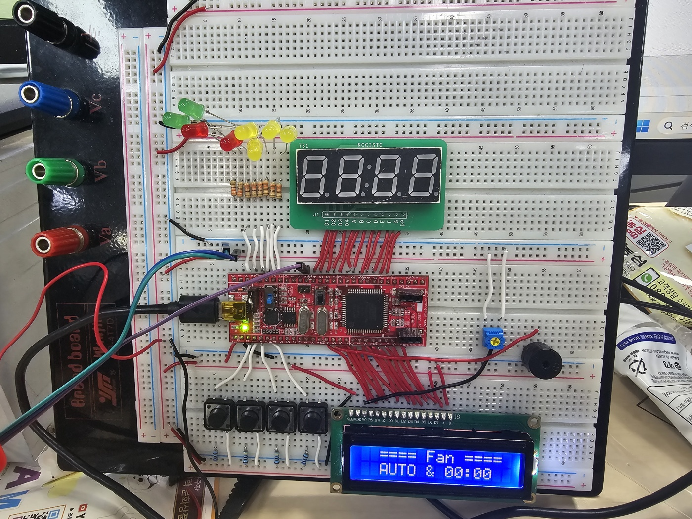
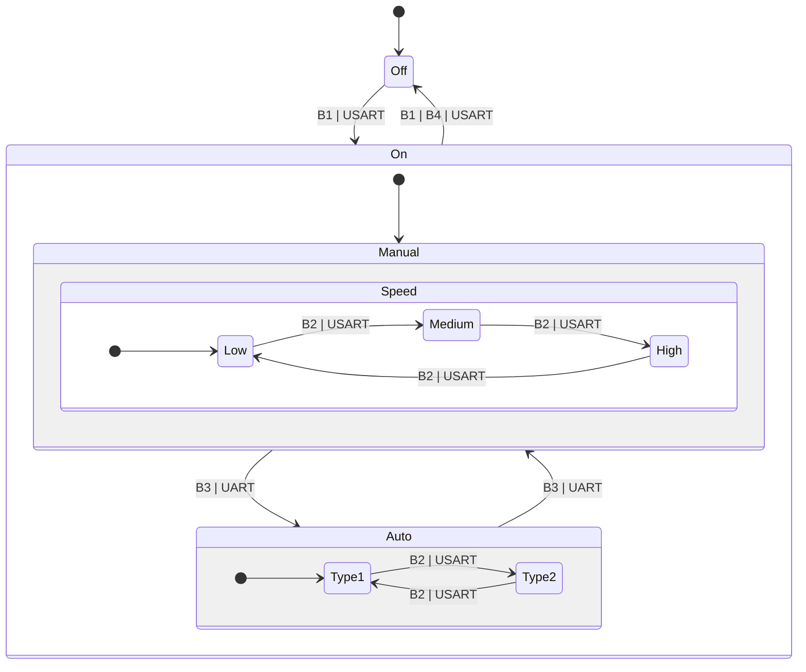

# Fan Project

📅 Written at 2025-01-03 09:44:20

- [Fan Project](#fan-project)
  - [Project Introduction](#project-introduction)
    - [Features](#features)
    - [🎯 Purposes](#-purposes)
    - [🖼️ Hardware Setup](#️-hardware-setup)
      - [Breadboard Setup](#breadboard-setup)
    - [🎥 Fan Machine Demo](#-fan-machine-demo)
  - [🌐 Project Overview](#-project-overview)
    - [FSM (Finite State Machine)](#fsm-finite-state-machine)
      - [🎛️ Inputs (Button Definitions)](#️-inputs-button-definitions)
      - [📊 Diagram](#-diagram)
    - [🛠️ Tools](#️-tools)
      - [\[🧑‍💻 Software\]](#-software)
      - [\[🖥️ Hardware\]](#️-hardware)
    - [📁 Directory Structure](#-directory-structure)
    - [📖 Design Patterns and Benefits](#-design-patterns-and-benefits)
      - [Layer Overview](#layer-overview)
      - [Applied Design Pattern](#applied-design-pattern)
      - [❗ Benefits of the MVP + Service Pattern](#-benefits-of-the-mvp--service-pattern)
  - [Retrospective](#retrospective)
    - [📌 Key Learnings and Improvements](#-key-learnings-and-improvements)

## Project Introduction

### Features

- 전원 제어: 선풍기 전원을 켜거나 끌 수 있음.
- 팬 속도 조절: 저속, 중속, 고속으로 팬 속도를 변경 가능.
- 모드 전환: 수동 모드와 자동 모드 간 전환 가능.
- 타이머 설정: 3, 5, 7분 타이머 설정으로 자동 종료.
- 상태 표시: LCD 및 FND로 현재 모드, 속도, 타이머 상태 표시.

### 🎯 Purposes

- **C 언어 코드 모듈화 및 구조화**

  - 명확한 디렉터리 구조 설계 (`app` -> `peripheral` (device) -> `driver`)
  - 구조체와 함수 포인터를 활용하여 객체지향적 설계 구현
  - 코드 일관성을 위한 명명 규칙(Naming Convention) 설정
  - 재사용성을 고려한 Utility 라이브러리 제작

- **디자인 패턴 학습 및 활용**

  - 🪱 Model-View-Presenter (MVP) + Service 패턴을 적용하여 시스템의 모듈화와 유지보수성을 강화
  - 구조적 설계를 통해 코드 재사용성 및 확장성 증대

- **외부 장치 제어 기술 숙련**

  - LCD, Buzzer, FND, Motor 등 다양한 장치를 제어하며 하드웨어와 소프트웨어 통합 기술 향상
  - UART 통신 프로토콜 이해 및 구현을 통한 장치 간 데이터 교환 학습
  - FND 디스플레이를 통해 출력 데이터를 시각적으로 표현하는 기술 학습

- **데이터 구조와 알고리즘 학습**

  - UART 수신 데이터 처리에서 🪱 원형 큐(Circular Queue)를 활용하여 **메모리 효율성**, **데이터 흐름 관리** 향상 및 **데이터 손실 방지**

- **데이터시트 분석 능력 향상**
  - 데이터시트를 기반으로 장치 특성을 파악하고 이를 구현에 반영하는 기술 강화

### 🖼️ Hardware Setup

#### Breadboard Setup



---

### 🎥 Fan Machine Demo

[](https://youtu.be/hGNbbrZe-AM "Watch on YouTube")

_Click on the image above to watch the full demo on [YouTube](https://youtu.be/hGNbbrZe-AM)._

---

## 🌐 Project Overview

### FSM (Finite State Machine)

📝 **Note**: State remains unchanged unless an explicit transition is defined.

#### 🎛️ Inputs (Button Definitions)

| **Button** | **Functionality**                                          |
| ---------- | ---------------------------------------------------------- |
| **B1**     | Toggle system power (On/Off)                               |
| **B2**     | Adjust fan speed (Manual or Auto mode)                     |
| **B3**     | Toggle between Auto mode and Manual mode (entry point)     |
| **B4**     | Set shutdown timer (None, 3 minutes, 5 minutes, 7 minutes) |

---

#### 📊 Diagram



### 🛠️ Tools

#### [🧑‍💻 Software]

- **IDE**: Microchip Studio
- **Programming Language**: C

#### [🖥️ Hardware]

- **Processor**: AVR Atmega128/A (RISC) (1 EM)
- **LCD Module**: TC1602A-01T (1 EM)
- **Button (Pull-up Circuit)**: CL5642AH30 (4 EM)
- **FND (Common-Cathode Type)**: - (1 EM)
- **Buzzer**: - (1 EM)
- **Motor**: - (1 EM)

---

### 📁 Directory Structure

├── 📂 **app**  
│&nbsp;&nbsp;&nbsp;&nbsp;└── 📂 **fanMachine**  
│&nbsp;&nbsp;&nbsp;&nbsp;&nbsp;&nbsp;&nbsp;&nbsp;├── [fanMachinApp.c](app/fanMachine/fanMachinApp.c)  
│&nbsp;&nbsp;&nbsp;&nbsp;&nbsp;&nbsp;&nbsp;&nbsp;├── 📂 listener  
│&nbsp;&nbsp;&nbsp;&nbsp;&nbsp;&nbsp;&nbsp;&nbsp;│&nbsp;&nbsp;&nbsp;&nbsp;└── [fanListener.c](app/fanMachine/listener/fanListener.c)  
│&nbsp;&nbsp;&nbsp;&nbsp;&nbsp;&nbsp;&nbsp;&nbsp;├── 📂 model  
│&nbsp;&nbsp;&nbsp;&nbsp;&nbsp;&nbsp;&nbsp;&nbsp;│&nbsp;&nbsp;&nbsp;&nbsp;└── [fanModel.c](app/fanMachine/model/fanModel.c)  
│&nbsp;&nbsp;&nbsp;&nbsp;&nbsp;&nbsp;&nbsp;&nbsp;├── 📂 presenter  
│&nbsp;&nbsp;&nbsp;&nbsp;&nbsp;&nbsp;&nbsp;&nbsp;│&nbsp;&nbsp;&nbsp;&nbsp;└── [fanPresenter.c](app/fanMachine/presenter/fanPresenter.c)  
│&nbsp;&nbsp;&nbsp;&nbsp;&nbsp;&nbsp;&nbsp;&nbsp;└── 📂 service  
│&nbsp;&nbsp;&nbsp;&nbsp;&nbsp;&nbsp;&nbsp;&nbsp;&nbsp;&nbsp;&nbsp;&nbsp;└── [fanService.c](app/fanMachine/service/fanService.c)  
├── 📂 **driver**  
│&nbsp;&nbsp;&nbsp;&nbsp;├── 📂 [gpio](driver/gpio/gpio.h)  
│&nbsp;&nbsp;&nbsp;&nbsp;├── 📂 [pwm](driver/pwm/pwm.h)  
│&nbsp;&nbsp;&nbsp;&nbsp;├── 📂 [timer](driver/timer/timer.h)  
│&nbsp;&nbsp;&nbsp;&nbsp;└── 📂 [uart](driver/uart/uart.h)  
├── [main.c](main.c)  
├── 📂 **peripheral**  
│&nbsp;&nbsp;&nbsp;&nbsp;├── 📂 [button](peripheral/button/button.h)  
│&nbsp;&nbsp;&nbsp;&nbsp;├── 📂 [buzzer](peripheral/buzzer/buzzer.h)  
│&nbsp;&nbsp;&nbsp;&nbsp;├── 📂 [fnd](peripheral/fnd/fnd.h)  
│&nbsp;&nbsp;&nbsp;&nbsp;├── 📂 [lcd](peripheral/lcd/lcd.h)  
│&nbsp;&nbsp;&nbsp;&nbsp;└── 📂 [motor](peripheral/motor/motor.h)  
├── 📂 **resource**  
│&nbsp;&nbsp;&nbsp;&nbsp;├── [fan_machine-breadboard_setup.jpg](resource/fan_machine-breadboard_setup.jpg)  
└── 📂 **utility**  
&nbsp;&nbsp;&nbsp;&nbsp;├── [bitmask.h](utility/bitmask.h)  
&nbsp;&nbsp;&nbsp;&nbsp;├── [boolean.h](utility/boolean.h)  
&nbsp;&nbsp;&nbsp;&nbsp;└── [clockTimer.h](utility/clockTimer.h)

---

### 📖 Design Patterns and Benefits

#### Layer Overview

| Layer             | Description                                                                  | Matching Directory                              |
| ----------------- | ---------------------------------------------------------------------------- | ----------------------------------------------- |
| Application Layer | User application logic. Controls devices and system flow.                    | `app/`                                          |
| OS/RTOS           | Operating system or real-time OS (if applicable).                            | `<None>`                                        |
| Devices Layer     | Manages external devices (motor, buzzer, button, lcd, fnd).                  | `peripheral/` (motor, buzzer, button, lcd, fnd) |
| HAL/Drivers       | Initializes hardware and controls MCU peripherals (GPIO, Timer, UART, etc.). | `driver/` (gpio, timer, uart, pwm)              |
| Hardware          | Physical hardware (MCU, sensors, etc.).                                      | AVR Atmega128/A, TC1602A-01T, etc.              |

#### Applied Design Pattern

The **Model-View-Presenter (MVP) + Service** pattern is used in the `app/fanMachine` directory to structure and organize the application logic. This design allows for a clean separation of responsibilities, making the system modular, testable, and maintainable.

1. **Model (`model/`)**:

   - Encapsulates the fan's state and data (e.g., speed, control mode, shutdown timer).
   - Provides getter and setter methods for managing internal states.
   - Example:
     ```c
     uint8_t getFanSpeedState() {
         return _fanSpeedState;
     }
     void setFanSpeedState(uint8_t fanSpeedState) {
         _fanSpeedState = fanSpeedState;
     }
     ```
   - **Responsibility**: Centralized state management.

2. **View (`listener/`)**:

   - Monitors user inputs (e.g., button presses, UART commands) and notifies the `Presenter` of changes.
   - Acts as an event listener for external interactions.
   - Example:
     ```c
     static void _fanListener_checkButtonEvent() {
         switch (releasedBtnPinNum) {
             case BUTTON_FAN_SPEED_PIN_NUM:
                 setFanSpeedStateToNext();
                 break;
             case BUTTON_FAN_CONTROL_MODE_PIN_NUM:
                 setFanControlModeStateNext();
                 break;
         }
     }
     ```
   - **Responsibility**: Handling user interactions and notifying the presenter.

3. **Presenter (`presenter/`)**:

   - Coordinates communication between the `Model` and `View`.
   - Updates the `Model` based on user input or system events and prepares data for presentation.
   - Example:
     ```c
     void fanPresenter_displaytoLcd(uint8_t minute, uint8_t second) {
         char buff[30];
         sprintf(buff, "%02d:%02d", minute, second);
         lcd.writeLcdStringToXy(&lcd, buff, 1, 2);
     }
     ```
   - **Responsibility**: Business logic coordination and data preparation.

4. **Service (`service/`)**:
   - Encapsulates reusable logic, such as timer management, motor speed control, and UART communication.
   - Provides advanced features like auto mode cycling and shutdown timer handling.
   - Example:
     ```c
     void _fanService_updateByCurrentState() {
         if (fanControlModeState == FAN_CONTROL_MODE_AUTO && fanControlAutoModeTimer.second >= fanControlModeAutoCycleSecond) {
             uint16_t randomDutyCycle = (rand() % 10 + 1) * 10;
             motor.setFanSpeed(&motor, randomDutyCycle);
         }
     }
     ```
   - **Responsibility**: Core reusable logic and advanced features.

---

#### ❗ Benefits of the MVP + Service Pattern

1. **Separation of Concerns**:

   - Each component (Model, View, Presenter, Service) has a distinct responsibility, reducing complexity.

2. **Modularity**:

   - Independent components allow for easier modifications, such as adding new features or replacing individual layers.

3. **Testability**:

   - Core logic in the `Service` layer and state management in the `Model` layer can be tested in isolation.

4. **Reusability**:

   - Services like `fanService` are designed for reuse in similar applications or machines.

5. **Scalability**:
   - Adding new features (e.g., additional fan modes or advanced timers) is straightforward due to the layered architecture.

---

## Retrospective

### 📌 Key Learnings and Improvements

1. **Hardware Documentation**

   ➡️ Prepare comprehensive documentation for hardware models, including **datasheet links**, to improve team accessibility and understanding.

   - Ensure the hardware model and its specifications are well-documented.

2. **Directory Naming Conventions**

   ➡️ Use consistent and standard terminology across future projects to improve clarity.

   - The directory name "peripheral" was used in this project but caused confusion, as it often refers to hardware registers in embedded systems.
   - Future projects should adopt more standard and widely accepted terms, such as ❗ **"device"**, which is frequently used for hardware components.
     - Example from Wiktionary:
       - [Device](https://en.wiktionary.org/wiki/device): A peripheral device; an item of hardware.
       - [Peripheral Device](https://en.wiktionary.org/wiki/peripheral_device#English): An external electronic device used by a computer.

3. **Naming Conventions in C for OOP Concepts**

   ➡️ Investigate industry-standard naming conventions for embedded systems to ensure best practices.

   - Attempting to follow OOP principles in C presented challenges, especially due to the lack of encapsulation in structs.
   - 🚣 Adopted a naming convention where the module name (PascalCase) is prefixed to the function name (camelCase) to simulate OOP structure.
   - Example:
     ```c
     static void _Fnd_setFndNum(fnd_t* fnd, uint16_t value) {
         fnd->value = value;
     }
     ```

4. **FSM Design Challenges**

   ➡️ Explore alternatives to simplify FSM design further while maintaining functionality.

   - The initial FSM design was overly complex and difficult to manage (see [Previous FSM Diagram](resource/previous_FSM.png)).
   - After re-evaluating the design, it became evident that a more **intuitive and simple structure** was possible.
   - **Lesson**: Invest more time in thoughtful design before implementation. Refer to 🔗 "\[FSM \(Finite State Machine\)\]" for the improved and cleaner FSM.

5. **Efficient Display Management**

   - Issues arose with FND display efficiency, such as atomicity concerns and redundant calculations.
   - 💡 **Minimize calculations inside interrupts**, and if complex calculations are necessary, increase intervals to avoid interference with other time-sensitive tasks.

---
